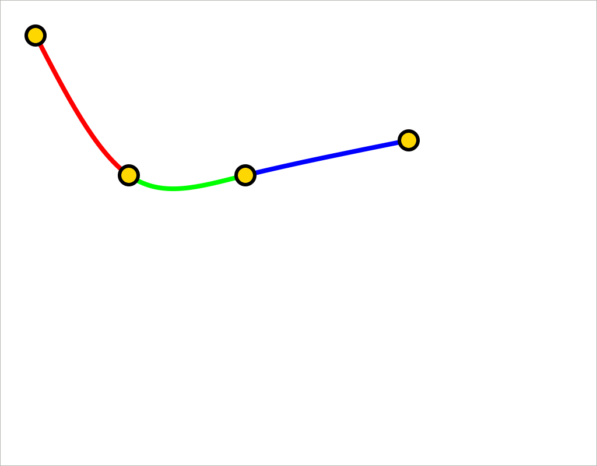

# Bezier Spline Interpolation

Ported from Lubos Brieda's implementation, live demo [here](https://www.particleincell.com/2012/bezier-splines/#demo).

This program draws a smooth curve that passes through the four knots using spline interpolation. The knots can be dragged around the screen to manipulate the curve.

The curve is defined by discrete bezier curves whose endpoints are the knots. Each bezier curve's control points are calculated by the algorithm from [Brieda's implementation](https://www.particleincell.com/wp-content/uploads/2012/06/bezier-spline.js).

### Build & Run (Linux only)

    make && ./a.out

### Dependencies

- `gtk3.0` (discoverable by `pkg-config`)

### Screenshot

